🏡 Real Estate Listing Platform (Frontend)

A modern real estate listing web platform built with Next.js and Tailwind CSS.
Currently under active development (frontend only).

📸 Screenshots

Preview of the UI in progress (from public/screenshots/):

 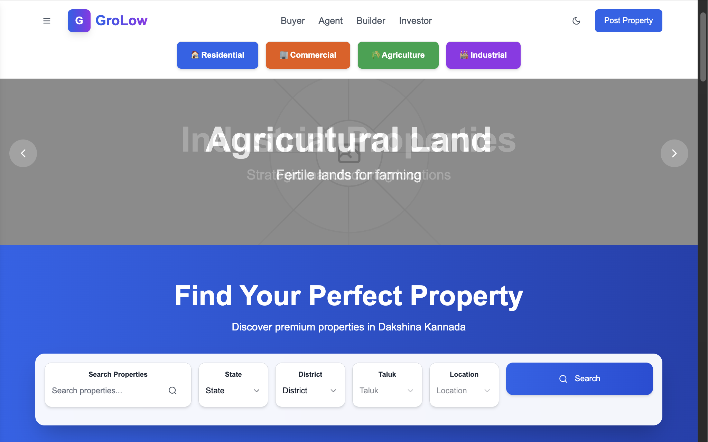 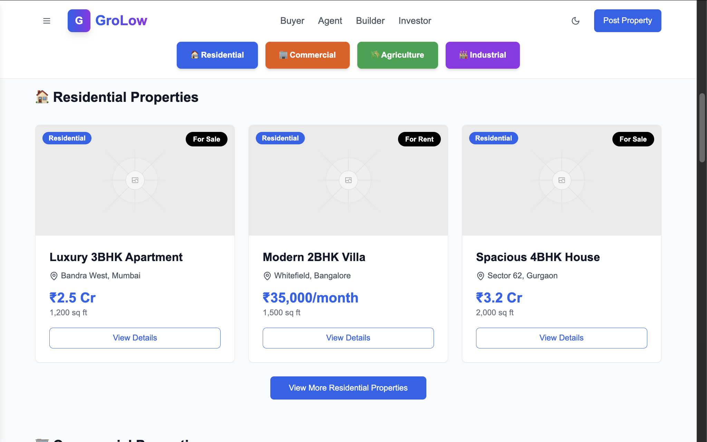 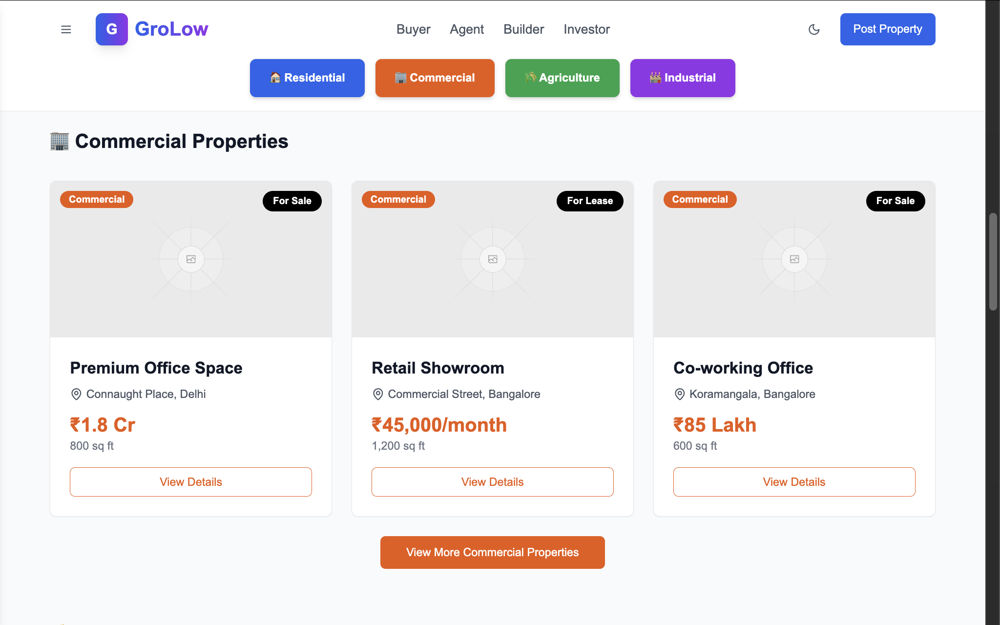 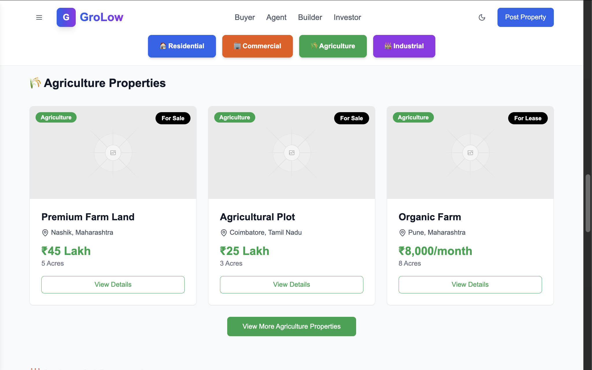 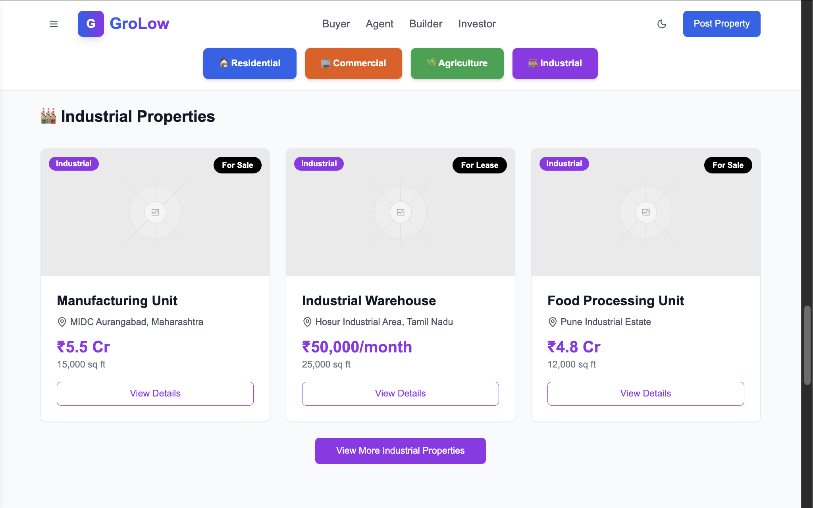 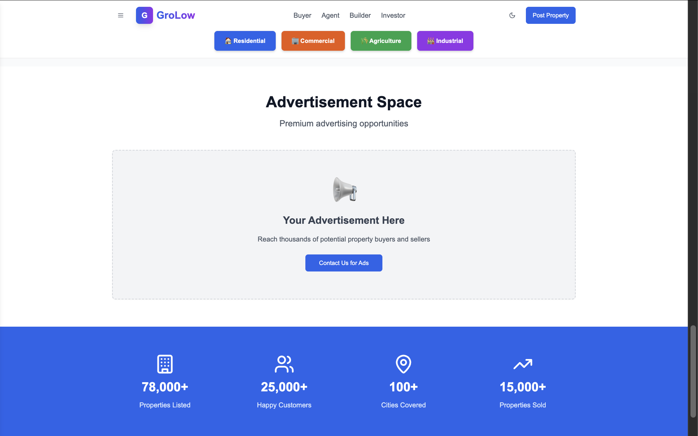 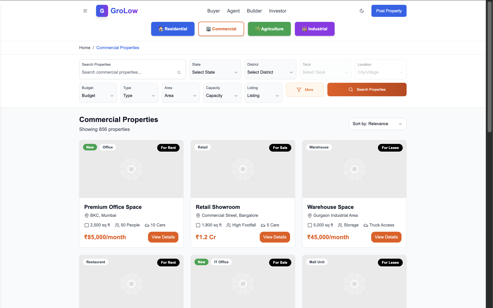 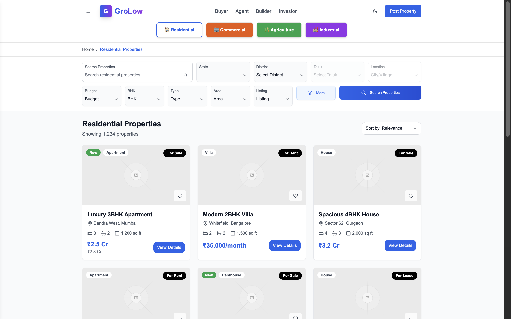 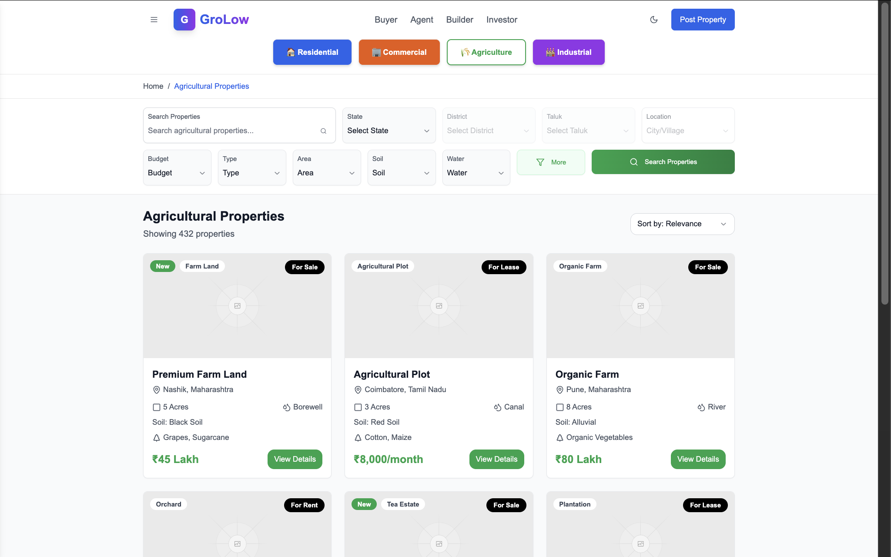 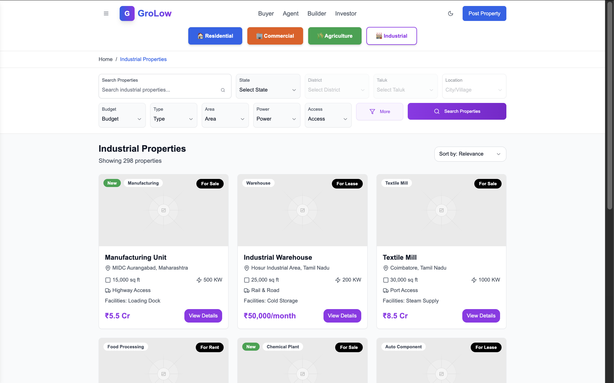 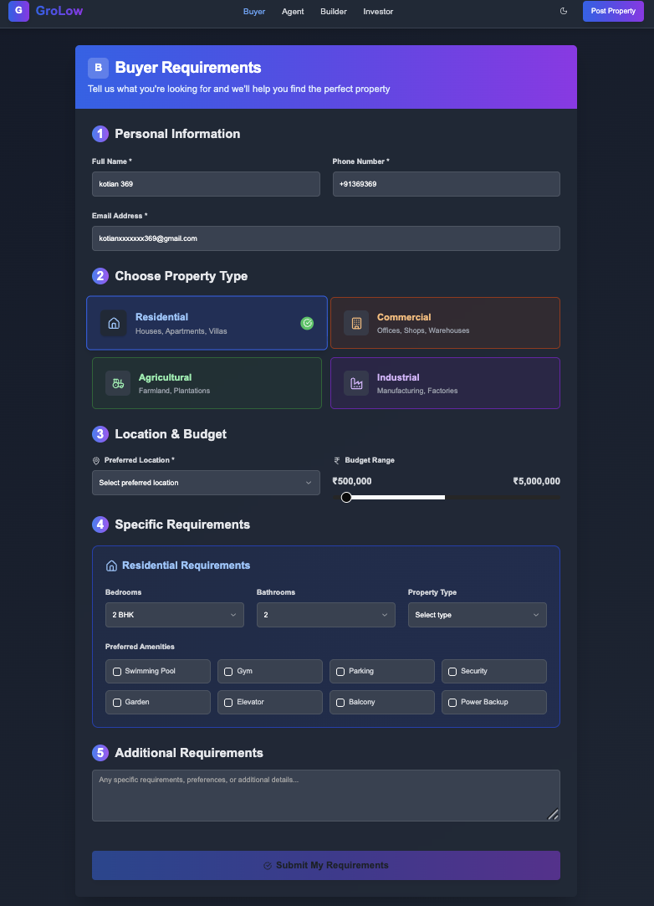 

🚀 Tech Stack

Next.js (App Router)

React + TypeScript

Tailwind CSS for modern, responsive design

shadcn/ui components

📁 Project Structure (Frontend)
.
├─ app/
│  ├─ globals.css         # Global Tailwind styles
│  ├─ layout.tsx          # Root layout wrapper
│  └─ page.tsx            # Main entry (landing / listing page)
│
├─ components/            # Reusable UI components
│  └─ ui/                 # shadcn/ui components
│
├─ public/
│  └─ screenshots/        # Screenshots for README
│     ├─ grulow100.png
│     ├─ grulow2.png
│     ├─ grulow103.png
│     └─ ... grulow111.png
│
├─ styles/
│  └─ globals.css         # Extra CSS overrides if needed
│
├─ .gitignore
├─ next.config.mjs
├─ package.json
├─ pnpm-lock.yaml
├─ postcss.config.mjs
├─ tailwind.config.js
└─ tsconfig.json

🛠️ Getting Started
1. Clone the repo
git clone https://github.com/your-username/real-estate-platform.git
cd real-estate-platform

2. Install dependencies

Using pnpm (recommended):

pnpm install

Or using npm:

npm install

3. Run the development server
pnpm dev
# or
npm run dev

Then open http://localhost:3000
 in your browser.

4. Build for production
pnpm build
pnpm start

🎯 Current Progress

✅ Landing page UI

✅ Listing grid & property cards

🚧 Search filters & sorting (in progress)

🚧 Property details page (coming soon)

🌐 Future Plans

Backend API integration for real listings

Authentication & user dashboard

Agent profile pages

Favorites & saved properties

🔒 License

This project is public for viewing and inspiration only.
It cannot be copied, reused, redistributed, or sold without explicit permission from the author.
